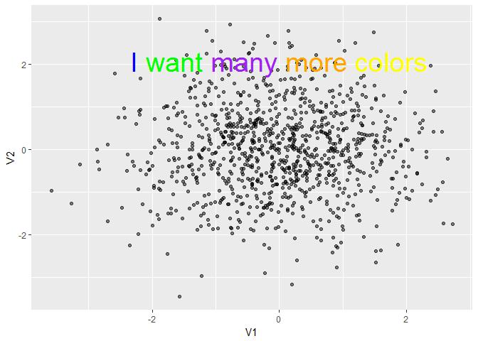
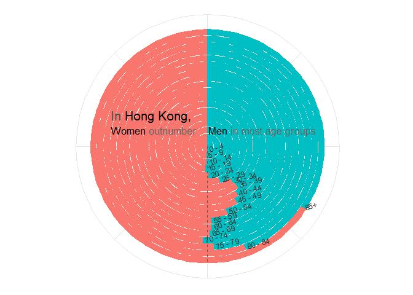

 

If you want to go straight to the function, you can find it at the
bottom of the page.

While working on a data visualization project, I discovered that ggplot2
does not allow for easy multicolor plot annoations. So after some
searching I discovered [this post from Andrew Whitby's
blog](https://andrewwhitby.com/2017/09/18/multi-color-text-ggplot2/comment-page-1/#comment-7400).
His method is to overlay multiple annotate() functions with plotmath
components to hide the parts of strings to allow the strings to overlap.
This method requires the text to be formatted as shown below:

    annotate('text', x = 3, y = .03, parse = T,label = '"I " * phantom("want many more colors")', color = 'grey') + 
    annotate('text', x = 3, y = .03, parse = T,label = 'phantom("I ") * "want" * phantom("many more colors")', color = 'blue') +
    annotate('text', x = 3, y = .03, parse = T,label = 'phantom("I want ") * "many" * phantom("more colors")', color = 'green') +
    annotate('text', x = 3, y = .03, parse = T,label = 'phantom("I want many ") * "more" * phantom("colors")', color = 'purple') +
    annotate('text', x = 3, y = .03, parse = T,label = 'phantom("I want many more ") * "colors"', color = 'orange') 

 

This code hides the word that isn't being passed through phantom() and
will color it. Then, it stacks the labels onto each other and prints
them on the plot. The huge downside of this method is that it is very
labor instensive and requires very specific formatting. So I decided to
write a function that writes all of the annotate() functions for me.

The function, annotate\_color(), takes its arguments in the same order
as annotate function and to call the same set of functions you would
just type:

    annotate_color(x = 3, y = .03, 
                   labels = 'I want many more colors',
                   colors = c('blue', 'green', 'purple', 'orange', 'yellow'))

 

Both of these blocks of code would evaluate to something like this:

Hopefully, you won't actually use it to create a graph that looks like
that as it is quite ugly.  
This is an example of how it could be better used.

 

### Input methods

    # Make or import your data
    data <- as.tibble(replicate(10, rnorm(1000))) 

    # Assigning a color for each word
    data %>% 
      ggplot(aes(x = V1, y = V2)) + 
      geom_point() + 
      annotate_color(x = 0, y = 2.7, size = 6,
                     labels = 'Assign different colors for each word',
                     colors = c('blue', 'green', 'purple', 'orange', 'black', 'yellow'))

    # Assigning a color for only one word in a string
    data %>% 
      ggplot(aes(x = V1, y = V2)) + 
      geom_point() + 
      annotate_color(x = 0, y = 2.7, default_color = 'black',
                     labels = 'Assign different colors for one word',
                     colors = c('', '', 'red')) # You must assign strings before the target word you want to color...
                                                # ... as words are colored in the order you type them

    #  Assigning colors for first and last words
    data %>% 
      ggplot(aes(x = V1, y = V2)) + 
      geom_point() + 
      annotate_color(x = 0, y = 2.7, default_color = 'purple', #
                     labels = 'Assign different colors for the first and last words',
                     colors = c('red', '', '', '', '', '', '', '', 'blue')) 

    # Coloring only the first word and all of the following words the same color. 
    data %>% 
      ggplot(aes(x = V1, y = V2)) + 
      geom_point() + 
      annotate_color(x = 0, y = 2.7, default_color = 'Grey30',
                     labels = 'Assign different colors for one word',
                     colors = c('red'))

    ### Notes
    # You can pass every argument that annotate() will accept into annotate_color().
    # The default geom type for annotate_color() is text, you can change it to any other geom that has a...
    # ... 'label' and a 'color'argument.
    # 'black' is the default value for 'default_color'

 

### The function

    ## This function will allow you to assign color to each word in a plot annotation
    # Dependencies: purrr, ggplot2

    annotate_color <- function(geom = 'text', x = NULL, y = NULL, xmin = NULL, xmax = NULL,  
                               ymin = NULL, ymax = NULL, xend = NULL, yend = NULL, ...,
                               labels = NULL, colors = NULL, default_color = 'black'){
      
      # Checks for essential arguments
      if (is.null(colors) || is.null(x) || is.null(y) || is.null(labels)){
        stop('Missing one of the arguments: labels, colors, x, or y')}
      
      
      labels <- strsplit(labels, " ")[[1]] 
      n <- length(labels)
      
      if (length(colors) < length(labels)){   # Assigns any empty values in 'colors' to the 'default_color' 
        colors <- map_chr(seq_len(length(labels)), function(i){
            if (is.na(colors[i]) | colors[i] == ''){
              colors[i] <- default_color
            } else {colors[i] <- colors [i]}}
         )
      }
      
      if (length(colors) > length(labels)){   # Shortens the length of 'colors' to match the length of 'labels'
        colors = colors[1:length(labels)]
        warning('The length of the colors arg is longer than the number of words in the labels arg. Extra colors will be ignored.')
      }
      
       # Formats the labels argument into usable arguments for each annotation function
        labels <- map_chr(seq_len(n), function(i) {  
          start0 <- labels[seq_along(labels) < i]    # Assigns the first part of the string 
          mid0 <- labels[i]                          # Assigns a single word 
          end0 <- labels[seq_along(labels) > i]      # Assigns the last part of the string
          start <- paste0('phantom("', paste(start0, collapse = " "), ' ")') # Wraps phantom() around the first part 
          end <- paste0('phantom("', paste(end0, collapse = " "), ' ")') # Wraps phantom() around the last part
          if(length(start0) > 0 && length(end0) > 0) {  # Conditional statements for the formatting depending...
            paste(start, paste0('"', paste(mid0, collapse = " "), '"'), end, sep = ' * ') # ... on the position of 'mid0'
          } else if (length(end0) > 0) {
            paste(paste0('"', paste(mid0, collapse = " "), '"'), end, sep = ' * ')
          } else if (length(start0) > 0) {
            paste(start, paste0('"', paste(mid0, collapse = " "), '"'), sep = ' * ')
          } else {
            stop("couldn't finish ...")
          } # Anonymous function above created with the assistance of
        })  # https://stackoverflow.com/users/3521006/docendo-discimus
      
      # Plugs all arguments into the annotate() function and stores them into a list
      annofuncs <- list()
      annofuncs <- map2(labels, colors, function(annolabel, annocolor){
        annofuncs[seq_along(annolabel)] <- list(annotate(geom, x, y, xmin, xmax, ymin, ymax, xend, yend, ...,
                                             parse = T, label = annolabel, color = annocolor))
      })
      return(annofuncs) # Returns the list which can be added to a ggplot like any other layer
    }
